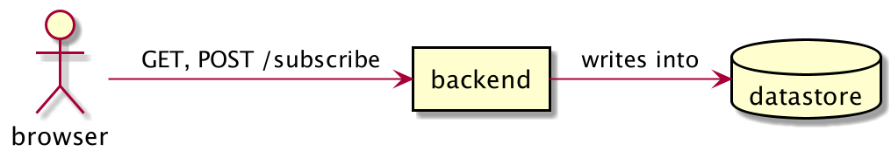
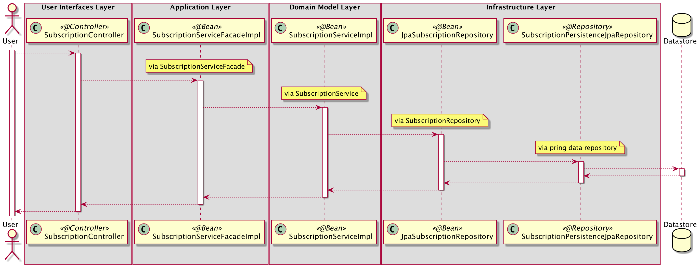

= Architecture By Examples
:imagesdir: docs/images
:imagesoutdir: docs/images

This repository demonstrates different architectures by implementing a simple use case. 

== Rationale

* majority of existing examples are often too bulky and too complicated

== Scope

=== In Scope

The application has

* one external e*ndpoint*
* one *use case*
* one *aggregate*
** one *entity*
** one *value object*
* one database *table*
* three *exceptions*
** one *exception* that can be thrown in presentation layer or application layer or domain layer
** one *exception* that can be thrown in domain layer
** one *exception* that can be thrown in domain layer but requires input from infrastructure layer

=== Out Scope

* does not have a bug free and flawless design
* does not demonstrates how to use various approach to tackle on same problem
* does not demonstrates how to use various design patterns

== Use case

.Single Use case
ifndef::env-github[]

endif::env-github[]
ifndef::env-idea[]
plantuml::docs/diagrams/use-case.puml[target=use-case,format=png]
endif::env-idea[]

.Database table
[source,sql]
----
CREATE TABLE IF NOT EXISTS subscriptions (
	id BINARY(36) PRIMARY KEY,
	email VARCHAR(512) NOT NULL,
	status VARCHAR(256) NOT NULL,
	created_at TIMESTAMP WITH TIME ZONE NOT NULL,
	last_updated_at TIMESTAMP WITH TIME ZONE NOT NULL,
	version BIGINT NOT NULL
);
----

== Architecture

[cols="1,1,2,4",options=header]
|===
|#|Name|Architecture|Description
|1|`chaos`|Chaos Architecture|A big ball of mud. It's just &#128169; everywhere. (Or should we call it Anarchy Architecture?)
|2|`3-tier`|3-tier Architecture|Most common way. Easy to understand. Easy to build. Difficult to maintain when it grows bigger.
|3|`ddd`|Domain Driven Design|Implement Eric Evan's masterpiece. Best effort to honor original intention
|4|`hex`|Hexagonal Architecture (Ports and Adapters)|Implement Alistair Cockburn's masterpiece. Best effort to honor original intention
|5|`hddd`|Hexagonal Domain Driven Design| Implement DDD using Hexagonal Architecture (also added personal preference)
|===

== How to test

* Import in your favourite IDE
* Start each project as a spring boot application individually
* Go to http://localhost:8080/subscribe
* *Four* conditions can be tested
+
[cols="1,4,2",options=header]
|===
|#|Input|Expected outcome
|1|empty input|fail
|2|not empty but invalid email format|fail
|3|correct email format|success
|4|correct email format but duplicate|fail
|===

* To verify DB records, go to:
+
[cols="h,4"]
|===
|URL|http://localhost:8080/h2-console
|JDBC URL| `jdbc:h2:mem:testdb`
|username|`sa`
|password|`password`
|===

== Overview

[cols="1,1,2,1,1,1,1,2",width="100%",options=header]
|===
|#
|Name
|Input
2+|Application Flow
2+|Business Logic
|Output

|1|`chaos`
6+|Presentation Layer, Business Logic Layer, Data Layer (anything could happen anywhere)

2+|
2+a|*Controller*:

* `SubscriptionController`
3+a|*Service*:

* `SubscriptionService`

a|* `Subscription`
* `SubscriptionRepository`

|2|`3-tier`
2+|Presentation Layer
3+|Business Logic Layer
|Data Layer

2+|
2+a|*Controller*:

* `SubscriptionController`
3+a|*Service*:

* `SubscriptionService`

a|* `Subscription`
* `SubscriptionRepository`

|3|`ddd`
|User Interfaces Layer
2+|Application Layer
2+|Domain Model Layer
|Infrastructure Layer

2+|
a| *Web Interface*:

* `SubscriptionController`

2+a| *Application Service*:

* `SubscriptionFacade`
* `SubscriptionFacadeImpl`

2+a|

* *Domain Service*:
** `SubscriptionService`
** `SubscriptionServiceImpl`
* *Entity*:
** `Subscription`
* *Repository*:
** `SubscriptionRepository`

a| *Spring Data Repository*:

* `JpaSubscriptionRepository`

|4|`hex`
|Input Adapters
2+|Application
2+|Core
|Output Adapters

2+|
a|*Web Input Adapter*:

*`SubscriptionController`

2+| `SubscriptionFacadeImpl`
2+a|
* *Input Port*: `SubscriptionFacade`
* *Entity*: `Subscription`
* *Use Cases*: `CreateSubscriptionUseCase`
* *Output Port*: `SubscriptionPersistencePort`
a| * *Persistence Output Adapter*:
** `JpaSubscriptionPersistenceAdapter`
* *Spring Data Repository*:
** `SubscriptionPersistenceJpaRepository`

|5|`hddd`
|User Interfaces Layer
2+|Application Layer
2+|Domain Model Layer
|Infrastructure Layer

2+|
a|*Web Input Adapter*:

* `SubscriptionController`

2+a| *Application Service*:

* `SubscriptionFacade`
* `SubscriptionFacadeImpl`

2+a|
* *Input Port*:
** `SubscriptionService`
* *Domain Service*:
** `SubscriptionServiceImpl`
* *Entity*:
** `Subscription`
* *Output Port*:
** `SubscriptionPersistencePort`
a|
* *Persistence Output Adapter*:
** `JpaSubscriptionPersistenceAdapter`
* *Spring Data Repository*:
** `SubscriptionPersistenceJpaRepository`

|===

== Chaos Architecture

*Brief Description of Duties & Responsibilities*:

* `*SubscriptionController*`: supposed to be receiving tasks from specific interface but...
* `*SubscriptionServiceImpl*`: supposed to be business logic but...
* `*SubscriptionRepository*`: do technology-specified persistence operations

.Sequence Diagram for Chaos Architecture
plantuml::docs/chaos/chaos-sequence.puml[target=chaos-sequence,format=png]

.Class Diagram for Chaos Architecture
plantuml::docs/chaos/chaos-class.puml[target=chaos-class,format=png]

== 3-tier Architecture

*Brief Description of Duties & Responsibilities*:

* `*SubscriptionController*`: receives tasks from specific interface but...
* `*SubscriptionServiceImpl*`: do business logic
* `*SubscriptionRepository*`: do technology-specified persistence operations

.Sequence Diagram for 3-tier Architecture
plantuml::docs/3-tier/3-tier-sequence.puml[target=3-tier-sequence,format=png,opts="inline"]

.Class Diagram for 3-tier Architecture
plantuml::docs/3-tier/3-tier-class.puml[target=3-tier-class,format=png,png-type="inline"]

=== DDD

*Brief Description of Duties & Responsibilities*:

* `*SubscriptionController*`: receives tasks from specific interface
* `*SubscriptionServiceFacadeImpl*`: task coordination, transaction, anti-corruption
* `*SubscriptionServiceImpl*`: business logic
* `*JpaSubscriptionRepository*`: anti-corruption, delegate persistence operations to `SubscriptionPersistenceJpaRepository`
* `*SubscriptionPersistenceJpaRepository*`: do technology-specified persistence operations

.Sequence Diagram for DDD Architecture
ifdef::env-github[]

endif::env-github[]
ifndef::env-idea[]
plantuml::docs/ddd/ddd-sequence.puml[target=ddd-sequence,format=png]
endif::env-idea[]

.Class Diagram for DDD Architecture
plantuml::docs/ddd/ddd-class.puml[target=ddd-class,format=png]

=== Hexagonal Architecture (Ports and Adapters)

*Brief Description of Duties & Responsibilities*:

* `*SubscriptionController*`: receives tasks from specific interface
* `*SubscriptionFacadeImpl*`: task coordination, transaction, anti-corruption
* `*CreateSubscription*`: business logic
* `*JpaSubscriptionAdapter*`: anti-corruption, delegate persistence operations to `SubscriptionPersistenceJpaRepository`
* `*SubscriptionPersistenceJpaRepository*`: do technology-specified persistence operations

.Sequence Diagram for Hexagonal Architecture
plantuml::docs/hex/hex-sequence.puml[target=hex-sequence,format=png]

.Class Diagram for Hexagonal Architecture
plantuml::docs/hex/hex-class.puml[target=hex-class,format=png]

=== Hexagonal DDD

*Brief Description of Duties & Responsibilities*:

* `*SubscriptionController*`: receives tasks from specific interface
* `*SubscriptionFacadeImpl*`: task coordination, transaction, anti-corruption
* `*CreateSubscription*`: business logic
* `*JpaSubscriptionAdapter*`: anti-corruption, delegate persistence operations to `SubscriptionPersistenceJpaRepository`
* `*SubscriptionPersistenceJpaRepository*`: do technology-specified persistence operations

.Sequence Diagram for Hexagonal DDD Architecture
plantuml::docs/hddd/hddd-sequence.puml[target=hddd-sequence,format=png]

.Class Diagram for Hexagonal DDD Architecture
plantuml::docs/hddd/hddd-class.puml[target=hddd-class,format=png]

